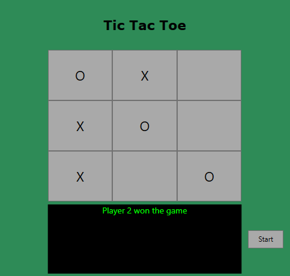

# Tic Tac Toe (WPF)

## About
This is a tic tac toe game made in a WPF application.

Players take turns marking X's and O's on 9-tiled 3x3 board.
- A console screen indicates which player's turn it is.
- A player wins once they match three of their X/O's in a row.

## Context
This application was made at the start Application Development I.

As an introduction to MVC, we were asked to create two Tic Tac Toe games backed by a dll model we created.

One of the games was made as a C# console app, while this one was made with WPF.

It was tough to figure out MVC, at first, but I was happy with how this turned out.

## How to run the app
1. Open the project in Visual Studio.
2. Click Run.
3. The players mark their characters by clicking the squares.
    - Player 1, as X, goes first.
    - Player 2, as O, follows.

4. This continues until either a player wins, or the match ends in a draw.
5. After the game is over, the player clicks Start to play again.
